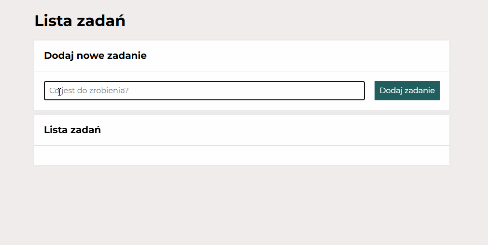

#  To-Do List Upgraded

A simple and improved To-Do List application built with HTML, CSS and JavaScript. 
This upgraded version includes new task-management features and better user experience.

---

## Live Demo

🔗 Live version: 
https://IzabelaK75.github.io/To-Do-List-Upgraded/

---

##  Feature Improvement

This upgrade introduces two new buttons that improve task management:

1. **Hide / Show Completed Tasks** – toggles the visibility of finished tasks. 
2. **Mark All as Completed** – marks every task as completed.

Additional behavior:
- The buttons are hidden when the task list is empty. 
- If all tasks are already completed, the “Mark All as Completed” button is disabled.

---

## Features

###  Core Features
- Add new tasks 
- Write and save tasks 
- Mark tasks as completed 
- Delete tasks 
- Local storage support 
- Responsive layout (works on mobile)

---

##  Technologies Used
- HTML5 
- CSS3 
- JavaScript (ES6+)

---

##  Author
**Izabela Kuc** 
GitHub profile: https://github.com/IzabelaK7
